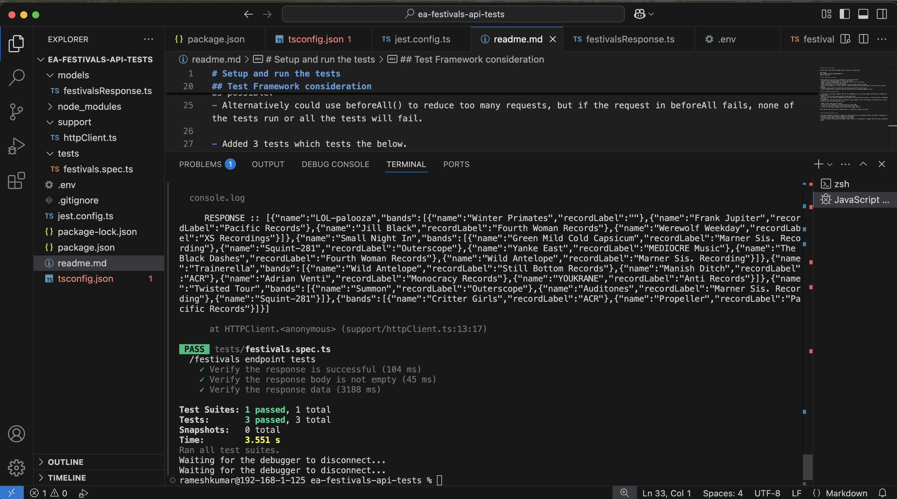

# Setup and run the tests

Run the tests using below commands (node.js setup is pre-requisite)

npm install
export NODE_TLS_REJECT_UNAUTHORIZED='0'
npm run test:apis

## Test framework strategy

- Used Typescript with jest test framework to setup this project.
- Installed the required packages by running npm install.
- Added a script in package.json to run the jest tests. "npm run test:apis".
- Setup tsconfig file for Typescript compiler.
- Setup jest.config.ts for jest to match tests from specified folders and paths.
- Since the API endpoint is a https request, created a HttpClient class under support files to get the request response.
- Created a model type for the festivals and bands to parse to the custom types.
- Finally created tests in festivals.spec.ts file which calls the above supportive files.

## Test Framework consideration

- As the API is throttling, added a function for getWithRetry() to retry the requests with delay to validate the response data.
- Unable to run the tests concurrently to avoid throttliing.
- Each test gets the response independently although its the same API and response, to keep the tests as independent as possible.
- Alternatively could use beforeAll() to reduce too many requests, but if the request in beforeAll fails, none of the tests run or all the tests will fail.

- Added 3 tests which tests the below.
1. Verify that the response is successful when it returns 200.
2. Verify on successful response, the response body is not empty.
3. Verify tat the response body has data as per the swagger contract.

The 3 above tests pass when the response there is a successful response with data

## Testing Observations/Issues

- API when exceeding the number of requests is throwing 429 error as expected, however the number of requests it is allowing is way too many making it behave less performant
- In some instances API is returning blank or no response
- There are fields returning null or empty strings. There is no requirement in swagger that the field is mandatory though.
